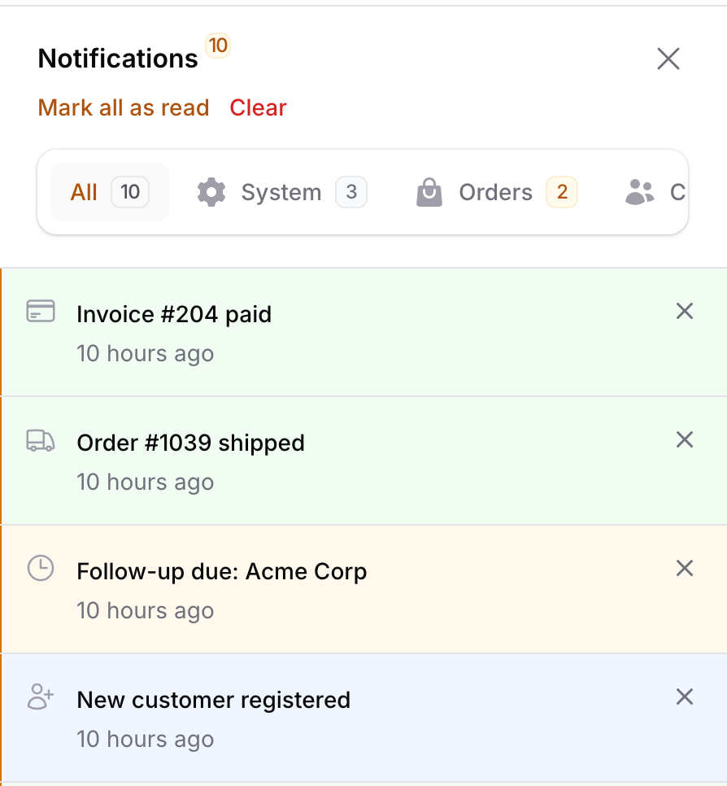

<h1 align="center">Filament Notification Center</h1>

<p align="center">
<strong>A smarter notification experience for Filament — categorized tabs for the notification drawer, with zero changes to how you already send notifications.</strong>
</p>

<p align="center">
<a href="https://packagist.org/packages/prodstarter/filament-notification-center"></a>
<a href="https://github.com/prodstarter/filament-notification-center/actions?query=workflow%3Arun-tests+branch%3Amain"></a>
<a href="https://github.com/prodstarter/filament-notification-center/actions?query=workflow%3A%22Fix+PHP+code+styling%22+branch%3Amain"></a>
<a href="https://packagist.org/packages/prodstarter/filament-notification-center"></a>
</p>

<p align="center">
<a href="#installation">Installation</a> ·
<a href="#features">Features</a> ·
<a href="#usage">Usage</a>
</p>

---



## Why Filament Notification Center

Filament's built-in notification drawer is intentionally simple: a single, flat, chronological list. That's fine for small apps, but once a panel starts receiving notifications from many different parts of a system — orders, billing, CRM, system alerts — a flat list quickly becomes hard to scan.

Filament Notification Center replaces the drawer's contents with **categorized tabs**, each with its own unread badge, while keeping every existing Filament notification API working exactly as before. There's no new way to send a notification — you just add `->category(...)` to the `Notification::make()` chain you already use.

## Features

- 🗂️ **Categorized tabs** in the notification drawer — "All" plus one tab per category you register, each with an unread count badge.
- 🔌 **Drop-in compatible** — `Notification::make()->title(...)->sendToDatabase($user)` keeps working unmodified. Add `->category('orders')` to file it under a tab.
- 🧩 **Per-panel configuration** — register a different set of categories per panel (admin, vendor, customer, ...) via the plugin instance.
- 🏷️ **Enum-friendly** — register categories as plain objects or as `BackedEnum` cases implementing Filament's `HasLabel` / `HasIcon` / `HasColor` contracts.
- 🎯 **No schema changes** — the category is stored in the existing notification `data` payload, so there's no migration to run and no risk to your existing notifications table.
- 🎨 **Looks native** — built entirely from Filament's own UI components (`x-filament::tabs`, `x-filament::modal`, `x-filament::empty-state`), so it matches your panel's theme, including dark mode.
- 📥 **Built-in import/export tabs** — enable dedicated "Imports"/"Exports" tabs in the config for Filament's import and export action completion notifications.
- 🧪 **Fully tested** — Pest test suite covering category filtering, unread counts, and the notification macro.

## Requirements

- PHP 8.2+
- Filament 5.0+

## Installation

Install the package via Composer:

```bash
composer require prodstarter/filament-notification-center
```

That's it — there's no migration to publish. Categories are stored inside the same `data` column your `notifications` table already has.

If you want to customize the default category name or override the empty-state text/behavior for every panel, you can publish the config file:

```bash
php artisan vendor:publish --tag="filament-notification-center-config"
```

This is the contents of the published config file:

```php
return [
    // The category ID that notifications sent without an explicit ->category()
    // are grouped under in the notification center drawer.
    'default_category' => 'general',
];
```

## Usage

### 1. Register the plugin on a panel

In your panel provider, register the plugin and define its categories. This replaces Filament's built-in notification drawer component for that panel — make sure `->databaseNotifications()` is enabled.

```php
use Filament\Panel;
use Filament\Support\Colors\Color;
use Filament\Support\Icons\Heroicon;
use Prodstarter\FilamentNotificationCenter\FilamentNotificationCenterPlugin;
use Prodstarter\FilamentNotificationCenter\NotificationCenterCategory;

public function panel(Panel $panel): Panel
{
    return $panel
        // ...
        ->databaseNotifications()
        ->plugins([
            FilamentNotificationCenterPlugin::make()->categories([
                NotificationCenterCategory::make('system')
                    ->label('System')
                    ->icon(Heroicon::Cog6Tooth)
                    ->color(Color::Gray)
                    ->order(1),
                NotificationCenterCategory::make('orders')
                    ->label('Orders')
                    ->icon(Heroicon::ShoppingBag)
                    ->color(Color::Amber)
                    ->order(2),
                NotificationCenterCategory::make('crm')
                    ->label('CRM')
                    ->icon(Heroicon::Users)
                    ->color(Color::Blue)
                    ->order(3),
                NotificationCenterCategory::make('billing')
                    ->label('Billing')
                    ->icon(Heroicon::CreditCard)
                    ->color(Color::Emerald)
                    ->order(4),
            ]),
        ]);
}
```

Because categories are registered on the plugin *instance*, different panels in the same app (e.g. `admin` and `vendor`) can each have their own set of tabs.

### 2. Send a categorized notification

Nothing about sending notifications changes — just add `->category()` to the chain:

```php
use Filament\Notifications\Notification;

Notification::make()
    ->title('New order #1042 received')
    ->icon('heroicon-o-shopping-bag')
    ->color('warning')
    ->category('orders')
    ->sendToDatabase($user);
```

Notifications sent **without** a category (including ones sent by other packages, or code written before you installed this plugin) automatically appear under the "General" tab, so nothing existing breaks when you add the plugin.

### 3. Use enums instead of raw strings (optional)

`->category()` also accepts a `BackedEnum`. If the enum implements Filament's `HasLabel`, `HasIcon`, and/or `HasColor` contracts, the tab's label, icon, and color are read straight from it — no need to also define a `NotificationCenterCategory` for it.

```php
use Filament\Support\Contracts\HasColor;
use Filament\Support\Contracts\HasIcon;
use Filament\Support\Contracts\HasLabel;

enum NotificationCategory: string implements HasColor, HasIcon, HasLabel
{
    case Orders = 'orders';
    case Crm = 'crm';

    public function getLabel(): string
    {
        return match ($this) {
            self::Orders => 'Orders',
            self::Crm => 'CRM',
        };
    }

    public function getIcon(): string
    {
        return match ($this) {
            self::Orders => 'heroicon-o-shopping-bag',
            self::Crm => 'heroicon-o-users',
        };
    }

    public function getColor(): string
    {
        return match ($this) {
            self::Orders => 'amber',
            self::Crm => 'info',
        };
    }
}
```

```php
FilamentNotificationCenterPlugin::make()->categories([
    NotificationCategory::Orders,
    NotificationCategory::Crm,
]);

Notification::make()
    ->title('New order #1042 received')
    ->category(NotificationCategory::Orders)
    ->sendToDatabase($user);
```

### 4. Customizing the default category and empty states

```php
FilamentNotificationCenterPlugin::make()
    ->categories([...])
    ->defaultCategory('general') // where uncategorized notifications land
    ->emptyStateUsing(fn (string $categoryId): array => [
        'heading' => "Nothing here yet",
        'description' => "You're all caught up in {$categoryId}.",
    ]);
```

### 5. Registering categories globally

If every panel in your app should share the same categories, you can register them once via the `NotificationCenter` facade in a service provider's `boot()` method instead of repeating them per panel. A panel only falls back to this global registration if the plugin instance on that panel has no categories of its own.

```php
use NotificationCenter;

NotificationCenter::categories([
    // ...
]);
```

### 6. Categorizing import/export notifications

Filament's [import](https://filamentphp.com/docs/5.x/actions/import) and [export](https://filamentphp.com/docs/5.x/actions/export) actions send a completion notification to the user once the job finishes. Filament Notification Center can file these under their own "Imports" and "Exports" tabs.

Enable the tab you want in the published config — this alone controls whether the tab exists and how it's labeled/colored/ordered:

```php
// config/notification-center.php
'imports' => [
    'enabled' => true,
    'category' => 'imports',
    'label' => 'Imports',
    'icon' => 'heroicon-o-arrow-up-tray',
    'color' => 'info',
    'order' => 90,
],
```

Filament calls `modifyCompletedNotification()` on your own `Importer`/`Exporter` class to let you customize the completion notification — there's no global hook for it, so add the matching trait to each `Importer`/`Exporter` you want tagged:

```php
use Filament\Actions\Imports\Importer;
use Prodstarter\FilamentNotificationCenter\Concerns\CategorizesImportNotifications;

class ProductImporter extends Importer
{
    use CategorizesImportNotifications;

    // ...
}
```

```php
use Filament\Actions\Exports\Exporter;
use Prodstarter\FilamentNotificationCenter\Concerns\CategorizesExportNotifications;

class ProductExporter extends Exporter
{
    use CategorizesExportNotifications;

    // ...
}
```

The trait's `modifyCompletedNotification()` reads the `enabled`/`category` config at send time, so flipping `enabled` back to `false` stops new notifications from being tagged without touching the Importer/Exporter class. If you already override `modifyCompletedNotification()` for your own customizations (changing the icon, adding actions, etc.), call the helper from inside it instead of using the trait directly:

```php
use Filament\Actions\Imports\Importer;
use Filament\Actions\Imports\Models\Import;
use Filament\Notifications\Notification;
use Prodstarter\FilamentNotificationCenter\Concerns\CategorizesImportNotifications;

class ProductImporter extends Importer
{
    use CategorizesImportNotifications;

    public static function modifyCompletedNotification(Notification $notification, Import $import): Notification
    {
        $notification = static::categorizeImportNotification($notification);

        return $notification->icon('heroicon-o-shopping-bag');
    }
}
```

## Testing

```bash
composer test
```

## Changelog

Please see [CHANGELOG](CHANGELOG.md) for more information on what has changed recently.

## Contributing

Please see [CONTRIBUTING](.github/CONTRIBUTING.md) for details.

## Security Vulnerabilities

Please review [our security policy](.github/SECURITY.md) on how to report security vulnerabilities.

## Credits

- [Stanley Ojadovwa](https://github.com/prodstarter)
- [All Contributors](../../contributors)

## License

The MIT License (MIT). Please see [License File](LICENSE.md) for more information.
